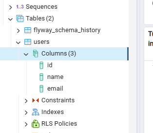
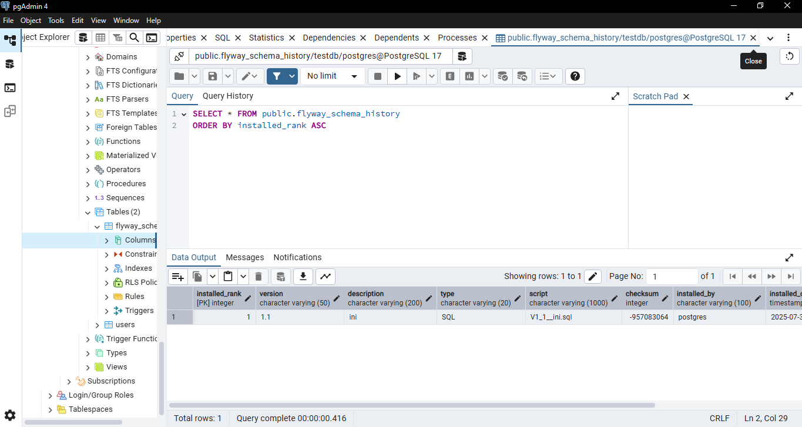

# Flyway Spring Boot Project
This project showcases the use of Flyway for database migration in a Spring Boot application, using JPA for managing database interactions.
# Overview
Framework: Spring Boot

Database: PostgreSQL

Database Migration: Flyway

Libraries Used: Spring Data JPA

# Dependencies 
Spring Boot Starter Data JPA

PostgreSQL JDBC Driver

Flyway Core

# Screenshots
Flyway schema updated successfully

V1 operation

