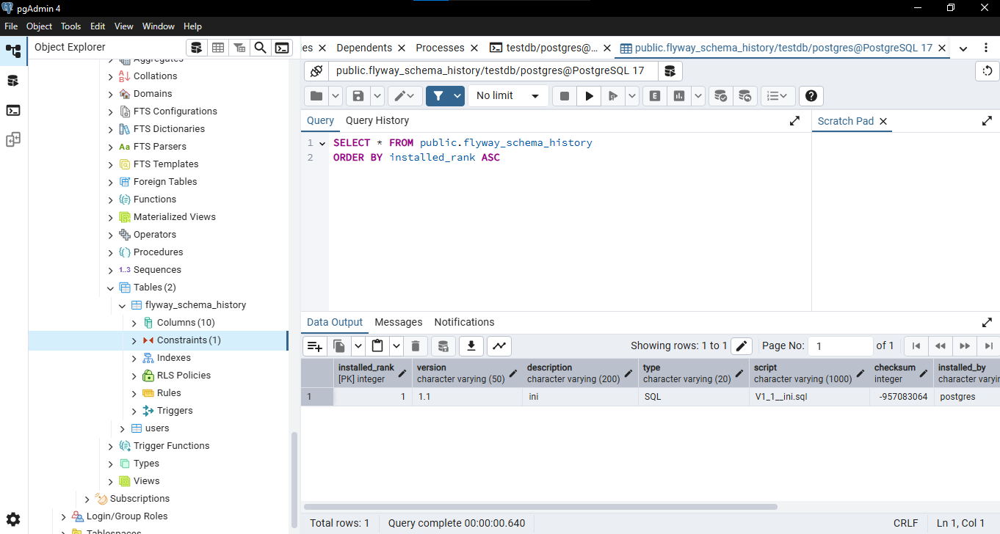

# Flyway Spring Boot Project
The project showcases the use of Flyway for database migration in a Spring Boot application, utilizing JPA for ORM and Lombok to reduce boilerplate code in database operations.
# Overview
Framework: Spring Boot
Database: PostgreSQL
Database Migration: Flyway
Libraries Used: Spring Data JPA, Lombok
# Dependencies 
Spring Boot Starter Data JPA
PostgreSQL JDBC Driver
Flyway Core
Lombok
# Screenshots
Fluway scema updated succesfully

V1 operation

